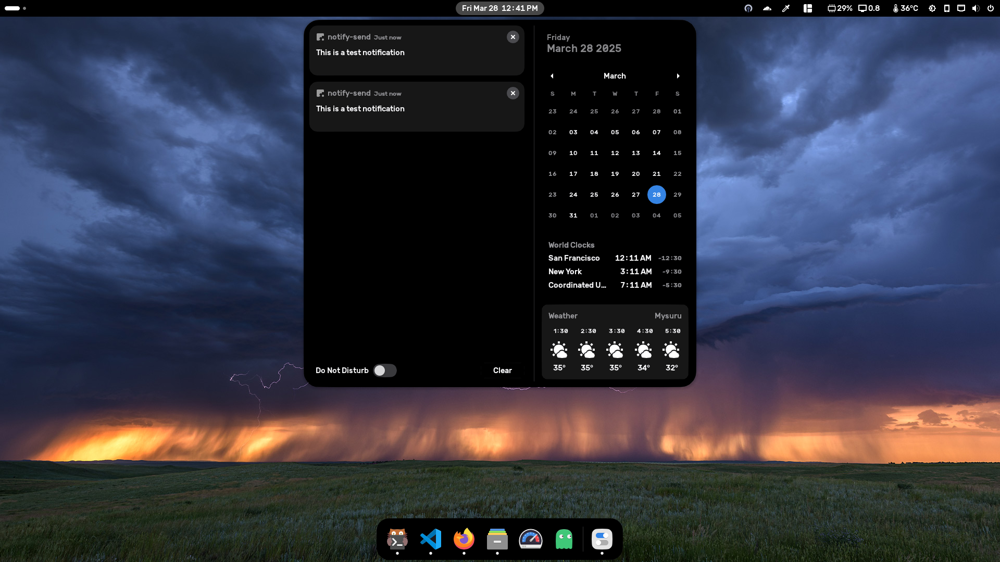
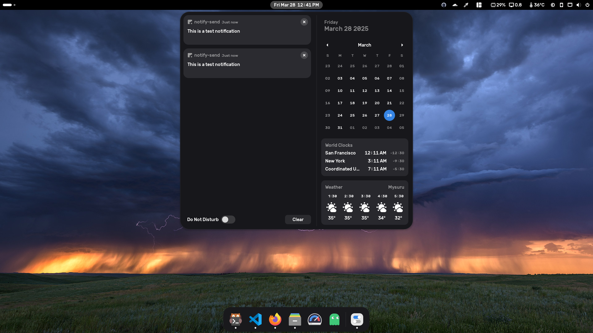
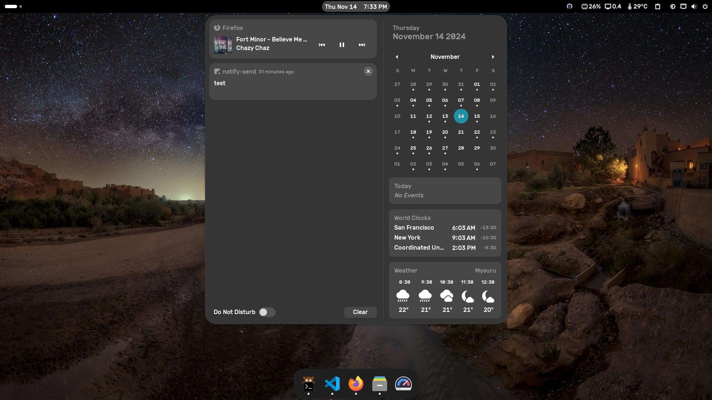

# Oledwaita
A darkest version of the default Adwaita gnome-shell theme for Gnome 48, clone of the [Darkwaita theme](https://github.com/varunbpatil/Darkwaita).

> [!NOTE]  
> Updated for Gnome 48 Bengaluru 🎉

This was created by adding an offset to some of the gray colors in the original theme. Absolutely nothing else has been modified. The `gnome-shell` folder contains the modified theme (`gnome-shell.css`) and the unmodified theme (`gnome-shell.css.original`) which can easily be compared to see what has been changed.

## Extensions worth using:
Original author suggests turning off "Customize the dash color" in the dash-to-dock settings "if you want it to match the Darkwaita theme", however `Customize the dash color` option with pure black works well too, just tweak the opacity to your liking.

- [Dash to Dock](https://micheleg.github.io/dash-to-dock/), [extension](https://extensions.gnome.org/extension/307/dash-to-dock/)
- [Blur my Shell](https://extensions.gnome.org/extension/3196/blur-my-shell/), [extension](https://extensions.gnome.org/extension/3193/blur-my-shell/)

## Installation
1. Clone this repository into `~/.local/share/themes`.
2. Select `Oledwaita` as the shell theme in gnome-tweaks.
3. Copy `gtk.css` to `~/.config/gtk-4.0/gtk.css`.

4. Restart Gnome Shell / log out and log back in.

## Screenshots
This is how Oled will look.


This is the Darkwaita theme in action.


This is the original Adwaita theme (Gnome 48). Gray color looks washed out.


## Getting the unmodified Gnome 48 Adwaita gnome-shell theme
If you are running Gnome 48, do:
```sh
mkdir /tmp/Adwaita && cd /tmp/Adwaita
cp /usr/share/gnome-shell/gnome-shell-theme.gresource .
for FILE in `gresource list gnome-shell-theme.gresource`; do gresource extract gnome-shell-theme.gresource $FILE > $(basename -- "$FILE"); done
```
