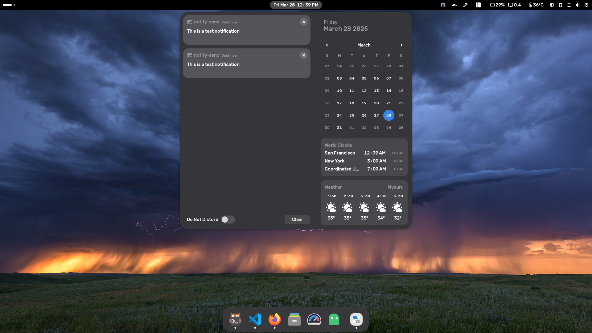

# Adwaita-darker
A darker version of the default Adwaita gnome-shell theme in Gnome 47. This is *ONLY* the gnome-shell theme.

This was created by adding an offset to some of the gray colors in the original theme. Absolutely nothing else has been modified. The `gnome-shell` folder contains the modified theme (`gnome-shell.css`) and the unmodified theme (`gnome-shell.css.original`) which can easily be compared to see what has been changed.

## Installation
1. Copy the `gnome-shell` folder to `~/.local/share/themes/Adwaita-darker` (create the folder if it doesn't exist).
2. Select it in gnome-tweaks.

## Dash-to-dock
Set the dash color to `#1f1f1f` in the dash-to-dock settings if you want it to match the Adwaita-darker theme.

## Screenshots
This is the Adwaita-darker theme in action.


This is the original Adwaita theme (Gnome 47). Gray color looks washed out.


## Getting the unmodified Gnome 47 Adwaita gnome-shell theme
If you are running Gnome 47, do:
```sh
mkdir /tmp/Adwaita && cd /tmp/Adwaita
cp /usr/share/gnome-shell/gnome-shell-theme.gresource .
for FILE in `gresource list gnome-shell-theme.gresource`; do gresource extract gnome-shell-theme.gresource $FILE > $(basename -- "$FILE"); done
```
